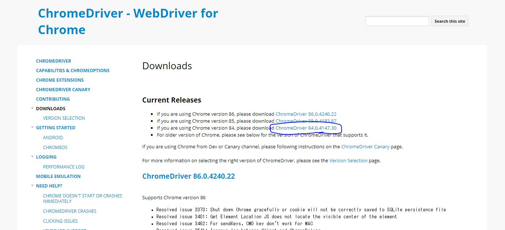
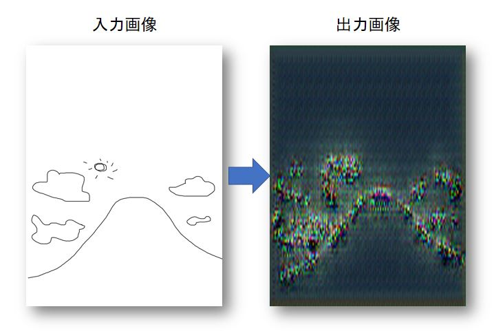
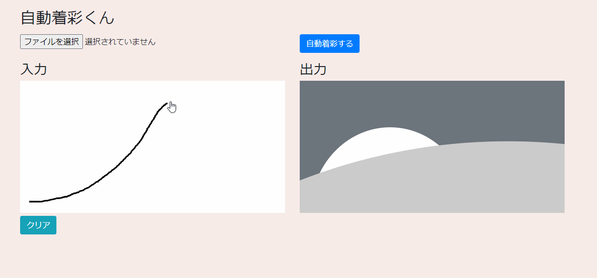

#『自動着彩AI』アプリを作ってみよう
##はじめに
###最終ゴールを決める
最終ゴールは、簡単な線を描くアプリと
その線から自動で絵を着彩するようなサービスを作りたいと思います。
今回の開発環境について
```commandline
ライブラリ等：Python3.6＋Keras2.2.4(Tensorflow-gpu1.14.0)
Windows10
開発の流れ
1.フォルダ構成と設計
2.スクレイピングによる画像収集
3.線画データの抽出
4.モデルの学習と評価
5.サーバー化してサービスにする
```
以上の5部構成にしたいと思います。

##1.フォルダ構成と設計
```commandline
-projects
 |-images
   |-example(評価用画像格納フォルダ)
   |-generated_images(学習中の経過画像格納フォルダ)
   |-edge(線画画像の格納フォルダ)
   |-color(元画像の格納フォルダ)
 |-templates
   -index.html
 |-static
 |-model(作成したモデルを保存するフォルダ)
 |-config.py
 |-scraping.py
 |-edge_transration.py
 |-train.py
 |-server.py
```

##2.スクレイピングによる画像収集
スクレイピングには以下のライブラリを利用します。
```commandline
pip install Pillow==7.1.1
pip install selenium==3.141.0
pip install bs4==0.0.1
pip install urllib3==1.25.8
pip install ulid-py==1.1.0
```

次に、Chromeのドライバーをダウンロードします。
[chromedriver_version = 84.0.4147.30のダウンロード](http://chromedriver.chromium.org/downloads)

windowsなので、chromedriver_win32.zipを選択しダウンロード、
staticの下にdriverとディレクトリを作成し、そこに解凍。
/static/driver/chromedriver.exeとなるようにしてください。

次はようやくコーディングに入ります。
まずは,config.pyの編集から
```python
import os
abs_path = os.getcwd()

class Env:
    ChromeDriver = abs_path + "\static\driver\chromedriver.exe"
    ScrapingCoolTime = 3
```

scraping.pyの編集
```python
import os
import time
from io import BytesIO, StringIO
from PIL import Image
from selenium import webdriver
from bs4 import BeautifulSoup
import urllib
import ulid
from config import Env

ScrapingTime = Env.ScrapingCoolTime
driver_path = Env.ChromeDriver

options = webdriver.chrome.options.Options()
options.add_argument('--headless')
options.add_argument('--disable-gpu')
options.add_argument('--user-agent=hogehoge')

#特定のWEBページからURLリストを取得する
def getScrapingImageURLs(url):
    time.sleep(ScrapingTime)
    driver = webdriver.Chrome(executable_path=driver_path, chrome_options=options)
    #driver = webdriver.Chrome(chrome_options=options)
    driver.get(url)
    html = driver.page_source.encode('utf-8')
    soup = BeautifulSoup(html, "html.parser")
    imgs = soup.find_all('img')
    image_urls = []
    for img in imgs:
        image_urls.append(img["src"])
    return image_urls

#画像のURLリストから指定ディレクトリに保存する
def saveImageFromURLs(image_urls, save_dir, save_type="local"):
    save_urls = []
    for index, image_url in enumerate(image_urls):
        filename = getULIDStr() + ".jpg"
        save_path = convDirAddName(save_dir, filename)
        try:
            pil_image = urlToPILImage(image_url)
            save_url = savePILImageInLocal(save_path, pil_image)
        except Exception as e:
            print("saveImageFromURLs Error")
            print(e)
            os.remove(save_path)
    return save_urls

def convDirAddName(dirname, filename):
    if dirname[-1] == "/" or dirname[-1] == "\\":
        return dirname+filename
    return dirname + "/" + filename

def urlToPILImage(url):
    f = BytesIO(urllib.request.urlopen(url).read())
    return Image.open(f)

def savePILImageInLocal(save_path, pil_image):
    pil_image.save(save_path)
    return save_path

def getULIDStr():
    id1 = ulid.new()
    return id1.str

if __name__ == "__main__":
    save_dir = "images/color"
    url = ''#スクレイピングしたいURL
    image_urls = getScrapingImageURLs(url)
    print(image_urls)
    save_urls = saveImageFromURLs(image_urls, save_dir)
    print("save complete")
```

urlのところにスクレイピングしたいURLを入れることでダウンロードができます。
高品質な写真が欲しいため、今回のスクレイピング先は"500px"というサービスから取得することにしました。
取得する画像は[青空](https://500px.com/search?submit=%E9%80%81%E4%BF%A1&q=%E9%9D%92%E7%A9%BA&type=photos)

```commandline
python scraping.py
```
これで実行すると、青空をテーマにした画像が50枚程度ダウンロードできました。
ただこれでは少ないので、空と雲の検索URLもスクレイピングし、150枚の画像を収集しました。
当然画像は少ないですが、とりあえずこれで進めていきます。


##2.画像データの線画化
こんにちは、前回に引き続き、自動着彩AIアプリを作ろう第3回目です。
読むのが面倒なときは、
```commandline
git clone https://github.com/foasho/AutoColoringProjects.git
pip install -r requirements.txt
python edge_transration.py
```
この3行で終わります。

まず必要なライブラリのインストールから
```commandline
pip install opencv-contrib-python==4.2.0.34
pip install opencv-python==4.2.0.34
pip install numpy==1.16.4
```

今日編集するのは、edge_transration.py
早速コードを書いていきましょう。
```python
import cv2
import numpy as np
import os

#線画変換
def edge_detect(cv2img):
    gray = cv2.cvtColor(cv2img, cv2.COLOR_BGR2GRAY)
    cv2.merge((gray, gray, gray), cv2img)
    kernel = np.ones((4, 4), np.uint8)
    dilation = cv2.dilate(cv2img, kernel, iterations=1)
    diff = cv2.subtract(dilation, cv2img)
    negaposi = 255 - diff
    return negaposi

if __name__=='__main__':
    target_dir = "./images/color/"
    save_dir_edge = "./images/edge/"
    if not os.path.exists(save_dir_edge):
        os.makedirs(save_dir_edge)
    image_names = os.listdir(target_dir)
    for image_name in image_names:
        read_path = target_dir + image_name
        try:
            color_image = cv2.imread(read_path)
            edge_image = edge_detect(color_image)
            cv2.imwrite(save_dir_edge + image_name + ".jpg", edge_image)
        except Exception as e:
            print(read_path)
            print("error")
            print(e)
```

たったこれだけです。
あとは、実行
```commandline
python edge_transration.py
```
これでimages/edge内に線画の画像が追加されたのを確認できればOKです。

お疲れ様でした。
次はとうとう用意した線画とカラー画像を使ってAIモデル学習をします。
PCはGPUでの計算推奨です。
されていない場合は、[Qiitaで設定の仕方の記事](https://qiita.com/osakasho/items/e3b0b14bd26ae1060413)
を書いているので、そちらを行ってから、次のセクションを行ってください。

ではまた。

##4.AIモデルの作成と評価
こんにちは、前回に引き続き、自動着彩AIアプリを作ろう第4回目AI生成編です。
とうとうですね。
いつも通りコードの解説は面倒くさいのでしません。読み取ってください。

読むのが面倒な方は以下の3行で。
```commandline
git clone https://github.com/foasho/AutoColoringProjects.git
pip install -r requirements.txt
python train.py
```

早速始めましょう。
まずは必要なライブラリのインストールから
```commandline
pip install tensorflow-gpu==1.14.0
pip install keras==2.2.4
```

今回編集するのはtrain.pyです
```python
from keras.models import Sequential, Model
from keras.layers import *
import os
os.environ["CUDA_VISIBLE_DEVICES"] = "0,1"
import sys
from keras.datasets import mnist
from keras.optimizers import Adam
from PIL import Image
import math
import numpy as np
import keras.backend as K
from keras.preprocessing.image import array_to_img, img_to_array, load_img
import re
from PIL import Image

import tensorflow as tf
import six

session_config = tf.ConfigProto(gpu_options=tf.GPUOptions(per_process_gpu_memory_fraction=0.9, allow_growth=False, visible_device_list=""))
tf.Session(config=session_config)
six.moves.input()

def list_pictures(directory, ext='jpg|jpeg|bmp|png|ppm'):
    return [os.path.join(root, f)
            for root, _, files in os.walk(directory) for f in files
            if re.match(r'([\w]+\.(?:' + ext + '))', f.lower())]


def unet(img_height, img_width):
    input_layer = Input(shape=(img_height, img_width, 1))
    conv1 = Conv2D(32, (3, 3), strides=(1, 1))(input_layer)
    conv1 = BatchNormalization()(conv1)
    conv1 = Activation('relu')(conv1)

    conv2 = Conv2D(64, (4, 4), strides=(2, 2))(conv1)
    conv2 = BatchNormalization()(conv2)
    conv2 = Activation('relu')(conv2)

    conv3 = Conv2D(128, (3, 4), strides=(2, 2))(conv2)
    conv3 = BatchNormalization()(conv3)
    conv3 = Activation('relu')(conv3)

    conv4 = Conv2D(256, (3, 4), strides=(2, 2))(conv3)
    conv4 = BatchNormalization()(conv4)
    conv4 = Activation('relu')(conv4)

    conv5 = Conv2D(512, (2, 2), strides=(1, 1))(conv4)
    conv5 = BatchNormalization()(conv5)
    conv5 = Activation('relu')(conv5)

    # 底辺
    conv6 = Conv2D(1024, (2, 2), strides=(1, 1))(conv5)  # 9x17 -> 8x16
    conv6 = BatchNormalization()(conv6)
    conv6 = Activation('relu')(conv6)
    # ##############

    # 折返し
    uconv6 = Conv2DTranspose(512, (2, 2), strides=(1, 1))(conv6)
    uconv6 = BatchNormalization()(uconv6)
    uconv6 = Activation('relu')(uconv6)
    uconv6 = Concatenate()([conv5, uconv6])

    uconv5 = Conv2DTranspose(256, (2, 2), strides=(1, 1))(uconv6)
    uconv5 = BatchNormalization()(uconv5)
    uconv5 = Activation('relu')(uconv5)
    uconv5 = Concatenate()([conv4, uconv5])

    uconv4 = Conv2DTranspose(128, (3, 4), strides=(2, 2))(uconv5)
    uconv4 = BatchNormalization()(uconv4)
    uconv4 = Activation('relu')(uconv4)
    uconv4 = Concatenate()([conv3, uconv4])

    uconv3 = Conv2DTranspose(64, (3, 4), strides=(2, 2))(uconv4)
    uconv3 = BatchNormalization()(uconv3)
    uconv3 = Activation('relu')(uconv3)
    uconv3 = Concatenate()([conv2, uconv3])

    uconv2 = Conv2DTranspose(32, (4, 4), strides=(2, 2))(uconv3)
    uconv2 = BatchNormalization()(uconv2)
    uconv2 = Activation('relu')(uconv2)
    uconv2 = Concatenate()([conv1, uconv2])

    uconv1 = Conv2DTranspose(3, (3, 3), strides=(1, 1))(uconv2)
    uconv1 = BatchNormalization()(uconv1)
    uconv1 = Activation('relu')(uconv1)

    model = Model(input_layer, uconv1)
    model.summary()

    return model


def train(x_dir, y_dir, img_height, img_width, Batch_size, Epoch_num, stepping_num, backup_num, model_dir, model_name):
    X, Y = [], []
    print("read x")
    for img in list_pictures(x_dir):
        img = img_to_array(load_img(img, target_size=(img_height, img_width), color_mode='grayscale'))
        img = np.reshape(img, (img_height, img_width, 1))
        X.append(img)
    print("read complete x")

    print("read y")
    for img in list_pictures(y_dir):
        img = img_to_array(load_img(img, target_size=(img_height, img_width)))
        Y.append(img)
    print("read complete y")

    X = np.asarray(X)
    X = X.astype(np.float32) / 255
    Y = np.asarray(Y)
    Y = Y.astype(np.float32) / 255
    model = unet(img_height, img_width)
    model.compile(loss='binary_crossentropy', optimizer=Adam(lr=1e-5, beta_1=0.1))

    num_batches = int(X.shape[0] / Batch_size)
    print('Number of batches:', num_batches)
    stepping_epoch = Epoch_num//stepping_num
    print("GenerateImage Step OutPut Epoch:", stepping_epoch)
    backup_epoch = Epoch_num//backup_num
    print("WeightsData Step OutPut Epoch:", backup_epoch)
    for epoch in range(Epoch_num):
        for index in range(num_batches):
            X_batch = X[index * Batch_size:(index + 1) * Batch_size]
            Y_batch = Y[index * Batch_size:(index + 1) * Batch_size]

            # # 生成画像を出力
            if index % stepping_epoch == 0:
                image = (model.predict(np.reshape(X[epoch * 9 % len(X)], (1, img_height, img_width, 1)), verbose=0))
                image = np.reshape(image, (img_height, img_width, 3))
                image = image * 255
                if not os.path.exists(GENERATED_IMAGE_PATH):
                    os.makedirs(GENERATED_IMAGE_PATH)
                Image.fromarray(image.astype(np.uint8)).save(GENERATED_IMAGE_PATH + "%04d_%04d.png" % (epoch, index))

            if epoch % backup_epoch == 999:
                model.save_weights(model_dir+str(epoch) + '_' + model_name)

            u_loss = model.train_on_batch(X_batch, Y_batch)
            print("epoch: %d, batch: %d, u_loss: %f" % (epoch, index, u_loss))

    model.save_weights(model_dir+model_name)

def predict(img_height, img_width, target_img_path, model_path):
    model = unet(img_height, img_width)
    model.compile(loss='categorical_crossentropy', optimizer=Adam(lr=0.001, beta_1=0.5), metrics=['accuracy'])
    model.load_weights(model_path)
    X, Y = [], []

    # 単独着彩
    X.append(img_to_array(load_img(target_img_path, target_size=(img_height, img_width), color_mode='grayscale')))

    X = np.asarray(X)
    X = X.astype(np.float32) / 255
    image = (model.predict(np.reshape(X[0], (1, img_height, img_width, 1)), verbose=0))
    image = np.reshape(image, (img_height, img_width, 3))
    image = image * 255
    pil_image = Image.fromarray(image.astype(np.uint8))
    width, height = Image.open(target_img_path).size
    resizeImage = pil_image.resize((width, height))
    resizeImage.save("predict.png")

if __name__=="__main__":
    Batch_size = 16
    Epoch_num = 1000
    stepping_num = 10#学習中モデルを使って画像を生成する回数
    backup_num = 3#学習中にモデルを何回保存するか
    img_height, img_width = 90, 160#PCが計算に耐えられるなら大きければ大きいほどいい
    GENERATED_IMAGE_PATH = './images/generated_images/'  # 生成画像の保存先ディレクトリ
    model_dir = "./model/"
    model_name = "AutoColor.h5"
    x_dir = './images/edge/'
    y_dir = './images/color/'

    #モデル生成　※評価だけしたい場合はコメントアウト
    train(x_dir, y_dir, img_height, img_width, Batch_size, Epoch_num, stepping_num, backup_num, model_dir, model_name)

    #評価
    target_img_path = "./images/example/test_predict.jpg"
    predict(img_height, img_width, target_img_path, model_dir+model_name)#評価
```

こんな感じです。ネットワークはUnetを利用します。
画像サイズは大きいのがベストですが、GPUメモリが大きい容量のものが必要です。
エポック数は実際にはもっと行った方がいいです。今回は時間の問題もあるので1000回で行います。
各自行う際は、大目に設定するのをお勧めします。
また、事前に取得・線画化した画像枚数は多ければ多いほどいいです。

さっそく実行
```commandline
python train.py
```

結果を見てみましょう
以下の図のような形になりました。


###・・。うん、頑張ってる感はあるよ！！
まぁコードはできたので、好きに画像収集とハイパーパラメータをいじって遊んでみてください(笑)

ここまでお疲れ様でした。
次は、サービス化をするためにFlaskでページを作成してWEBアプリとして完成させます。
次でラストになりますので、気張っていきましょ～。


##自動着彩AIをWEBアプリ化してみよう
こんにちは！
GDSの審査に通ってから毎朝何かしらUpしようとルーティーンにブログ更新を入れているのですが、正直きついです。朝、夜の更新だったのを朝のみの更新にしました。

そんなことはどうでもよくてとうとう自動着彩シリーズも今回で終わりです。
ソースはオープンソースにするので、各自自由にいじって理想のサービスに昇華させてポートフォリオ等の一部にしてもらえたらと思います。

毎度のことながら、読むのが面倒な方は以下の4行で完結します
```commandline
git clone https://github.com/foasho/AutoColoringProjects.git
pip uninstall tensorflow-gpu
pip install flask==1.1.2 tensorflow==1.14.0
python server.py
```

では、さっそくやっていきましょう。
```commandline
pip install flask==1.1.2
pip uninstall tensorflow-gpu==1.14.0
pip install tensorflow==1.14.0
```

まずは、HTMLでページを作りましょう。
templatesフォルダの中にあるindex.htmlを編集
本当はstaticにcssとjsのようなフォルダを作るのですが、
今回は、HTMLにそのまま書きます。
```html
<!DOCTYPE html>
<html lang="ja">
<head>
    <meta charset="UTF-8">
    <title>自動着彩ペイントアプリ</title>
    <!-- Bootstrap CSS -->
    <link rel="stylesheet" href="https://stackpath.bootstrapcdn.com/bootstrap/4.5.0/css/bootstrap.min.css" integrity="sha384-9aIt2nRpC12Uk9gS9baDl411NQApFmC26EwAOH8WgZl5MYYxFfc+NcPb1dKGj7Sk" crossorigin="anonymous">
</head>
<body>
<div class="container mt-3">
    <h2>自動着彩くん</h2>
    <div class="row my-3">
        <div class="col-md-6">
            <input id="userfile" type="file" accept="image/png,image/jpeg" />
        </div>
        <div class="col-md-6">
            <button class="btn btn-primary" onclick="startAutoColor()">自動着彩する</button>
        </div>
    </div>
    <div class="row my-3">
        <div class="col-md-6">
            <h3>入力</h3>
            <canvas id="draw_canvas"></canvas>
            <button class="btn btn-info" onclick="clearCanvas()">クリア</button>
        </div>
        <div class="col-md-6">
            <h3>出力</h3>
            
        </div>
    </div>
</div>
<style>
    body {
        background: #f8ece9;
    }
    #draw_canvas {
        width: 100%;
        background: rgba(255, 255, 255, 0.97);
        cursor: pointer;
    }
    #result_img {
        width: 100%;
    }
</style>
<script>
    var draw_canvas = document.getElementById('draw_canvas');
    var draw_canvas_ctx = draw_canvas.getContext('2d');
    var canvas_width = draw_canvas.clientWidth;
    var canvas_height = draw_canvas.clientHeight;
    draw_canvas.width = canvas_width;
    draw_canvas.height = canvas_height;
    draw_canvas_ctx.fillStyle = "#ffffff";
    draw_canvas_ctx.fillRect(0, 0, canvas_width, canvas_height);

    function clearCanvas() {
        draw_canvas_ctx.fillStyle = "#ffffff";
        draw_canvas_ctx.fillRect(0, 0, canvas_width, canvas_height);
    }

    var result_img = document.getElementById("result_img");

    function startAutoColor() {
        let formData = new FormData();
        const target_url = "auto-color";
        let image_data = draw_canvas.toDataURL("image/png");
        image_data = image_data.replace(/^data:image\/png;base64,/, "");
        formData.append("paint_image", image_data);
        let record_request = new XMLHttpRequest();
        record_request.open("POST", target_url, true);
        const record_response = record_request.send(formData);
        record_request.onload = function (oEvent) {
            if (record_request.status == 200){
                const result_image = record_request.response;
                result_img.src = result_image;
            }
        };
    }
    //ファイルを選択したとき
    document.getElementById("userfile").addEventListener("input", (event)=>{
        const target = event.target;
        const file = target.files[0];
        if(!file.type.match('image.*')) {
            alert('画像を選択してください');
            return;
        }
        let image = new Image();
        const reader = new FileReader();
        reader.addEventListener("load", ()=>{
            image.src = reader.result;
            image.onload = function() {
                var width, height;
                if(image.width > image.height){
                    var ratio = image.height/image.width;
                    width = canvas_width;
                    height = canvas_width * ratio;
                } else {
                    // 縦長の画像は縦のサイズを指定値にあわせる
                    var ratio = image.width/image.height;
                    width = canvas_height * ratio;
                    height = canvas_height;
                }
                console.log("resize");
                draw_canvas.width = width;
                draw_canvas.height = height;
                draw_canvas_ctx.drawImage(image, 0, 0, width, height);
            }
        });
        reader.readAsDataURL(file);
    });

    //ペイント処理
    // 描画用フラグ  true: 描画中   false: 描画中でない
    var flgDraw = false;
    // 座標
    var gX = 0;
    var gY = 0;
    // 描画色
    var gColor = '#000000';
    window.onload = function() {
        draw_canvas.addEventListener('mousedown', startDraw, false);
        draw_canvas.addEventListener('mousemove', Draw, false);
        draw_canvas.addEventListener('mouseup', endDraw, false);
    }
    // 描画開始
    function startDraw(e){
        flgDraw = true;
        var pointerPosition = getRelativePosition(e.clientX, e.clientY);
        gX = pointerPosition.x;
        gY = pointerPosition.y;
    }
    // 描画
    function Draw(e){
        if (flgDraw == true){
            var pointerPosition = getRelativePosition(e.clientX, e.clientY);
            const x = pointerPosition.x;
            const y = pointerPosition.y;
            draw_canvas_ctx.lineWidth = 3;
            draw_canvas_ctx.strokeStyle = gColor;
            // 描画開始
            draw_canvas_ctx.beginPath();
            draw_canvas_ctx.moveTo(gX, gY);
            draw_canvas_ctx.lineTo(x, y);
            draw_canvas_ctx.closePath();
            draw_canvas_ctx.stroke();
            // 次の描画開始点
            gX = x;
            gY = y;
        }
    }
    // 描画終了
    function endDraw(){
        flgDraw = false;
    }
    function getRelativePosition(absoluteX, absoluteY) {
        var rect = draw_canvas.getBoundingClientRect();
        return {x: absoluteX - rect.left, y: absoluteY - rect.top};
    }
</script>
</body>
</html>
```

次にconfig.pyにAIモデルの重みファイルのパスを追加
```python
import os
abs_path = os.getcwd()

class Env:
    ChromeDriver = abs_path + "\static\driver\chromedriver.exe"
    ScrapingCoolTime = 3

    MODEL_PATH = "static/model/AutoColor.h5"
```

新規ファイルauto_color.pyを新規作成
※config.pyと同じ階層
```python
# -*- coding: utf-8 -*-
import numpy as np
from keras.models import load_model, Model
from keras.layers import Input, Conv2D, BatchNormalization, Activation, Conv2DTranspose, Concatenate
from keras.optimizers import Adam
from keras.preprocessing.image import array_to_img, img_to_array, load_img
from PIL import Image
import tensorflow as tf

from config import Env

def getModel(img_height, img_width):
    input_layer = Input(shape=(img_height, img_width, 1))
    conv1 = Conv2D(32, (3, 3), strides=(1, 1))(input_layer)
    conv1 = BatchNormalization()(conv1)
    conv1 = Activation('relu')(conv1)

    conv2 = Conv2D(64, (4, 4), strides=(2, 2))(conv1)
    conv2 = BatchNormalization()(conv2)
    conv2 = Activation('relu')(conv2)

    conv3 = Conv2D(128, (3, 4), strides=(2, 2))(conv2)
    conv3 = BatchNormalization()(conv3)
    conv3 = Activation('relu')(conv3)

    conv4 = Conv2D(256, (3, 4), strides=(2, 2))(conv3)
    conv4 = BatchNormalization()(conv4)
    conv4 = Activation('relu')(conv4)

    conv5 = Conv2D(512, (2, 2), strides=(1, 1))(conv4)
    conv5 = BatchNormalization()(conv5)
    conv5 = Activation('relu')(conv5)

    # 底辺
    conv6 = Conv2D(1024, (2, 2), strides=(1, 1))(conv5)  # 9x17 -> 8x16
    conv6 = BatchNormalization()(conv6)
    conv6 = Activation('relu')(conv6)
    # ##############

    # 折返し
    uconv6 = Conv2DTranspose(512, (2, 2), strides=(1, 1))(conv6)
    uconv6 = BatchNormalization()(uconv6)
    uconv6 = Activation('relu')(uconv6)
    uconv6 = Concatenate()([conv5, uconv6])

    uconv5 = Conv2DTranspose(256, (2, 2), strides=(1, 1))(uconv6)
    uconv5 = BatchNormalization()(uconv5)
    uconv5 = Activation('relu')(uconv5)
    uconv5 = Concatenate()([conv4, uconv5])

    uconv4 = Conv2DTranspose(128, (3, 4), strides=(2, 2))(uconv5)
    uconv4 = BatchNormalization()(uconv4)
    uconv4 = Activation('relu')(uconv4)
    uconv4 = Concatenate()([conv3, uconv4])

    uconv3 = Conv2DTranspose(64, (3, 4), strides=(2, 2))(uconv4)
    uconv3 = BatchNormalization()(uconv3)
    uconv3 = Activation('relu')(uconv3)
    uconv3 = Concatenate()([conv2, uconv3])

    uconv2 = Conv2DTranspose(32, (4, 4), strides=(2, 2))(uconv3)
    uconv2 = BatchNormalization()(uconv2)
    uconv2 = Activation('relu')(uconv2)
    uconv2 = Concatenate()([conv1, uconv2])

    uconv1 = Conv2DTranspose(3, (3, 3), strides=(1, 1))(uconv2)
    uconv1 = BatchNormalization()(uconv1)
    uconv1 = Activation('relu')(uconv1)

    model = Model(input_layer, uconv1)
    # model.summary()

    return model

img_height, img_width = 90, 160
model = getModel(img_height, img_width)
model.compile(loss='categorical_crossentropy', optimizer=Adam(lr=0.001, beta_1=0.5), metrics=['accuracy'])
model.load_weights(Env.MODEL_PATH)
model._make_predict_function()
graph = tf.get_default_graph()

def autoColor(pil_image):
    width, height = pil_image.size
    pil_image = pil_image.resize((img_width, img_height)).convert('L')
    X, Y = [], []
    # 単独着彩
    X.append(img_to_array(pil_image))
    X = np.asarray(X)
    X = X.astype(np.float32) / 255
    global graph
    with graph.as_default():
        image = (model.predict(np.reshape(X[0], (1, img_height, img_width, 1)), verbose=0))
    image = np.reshape(image, (img_height, img_width, 3))
    image = image * 255
    result_image = Image.fromarray(image.astype(np.uint8))
    resizeImage = result_image.resize((width, height))
    return resizeImage
```

server.pyの編集
```python
from flask import Flask, request, render_template, abort
import base64
from PIL import Image
from io import BytesIO
from auto_color import autoColor

app = Flask(__name__)

@app.route("/")
def index():
    return render_template("index.html")

@app.route("/auto-color", methods=['POST'])
def auto_color():
    paint_image = request.form['paint_image']
    img_binary = base64.b64decode(paint_image)
    pil_image = Image.open(BytesIO(img_binary))
    resultImage = autoColor(pil_image)
    buffered = BytesIO()
    resultImage.save(buffered, format="JPEG")
    img_str = "data:image/jpeg;base64," + base64.b64encode(buffered.getvalue()).decode("ascii")
    return img_str

if __name__ == '__main__':
    app.run()

```

これで準備完了

さっそく実行してみよう
```
python server.py
```

####いい感じ～～


##完成！！！！
正直完成度は低いですが、いくらでも改善の余地があると思うので、
あとは各々好きに改造してください。

私の方のペイントアプリでも今回の自動着彩機能の追加をしておきました。
やった！これで私もAIエンジニア(笑)になれました！

第５回まで観た方、お疲れさまでした。
全作業量としては４時間～５時間程度でしょうか。
比較的に簡単に画像収集からAI作成、サービス化まで簡単にできました。
１～５のすべてのセクションは後で全てまとめてQiitaとこの記事にアップロードしようと思います。

次回からは、
スクレイピング技術の掘り下げをしようと思っています。

ではまた！
